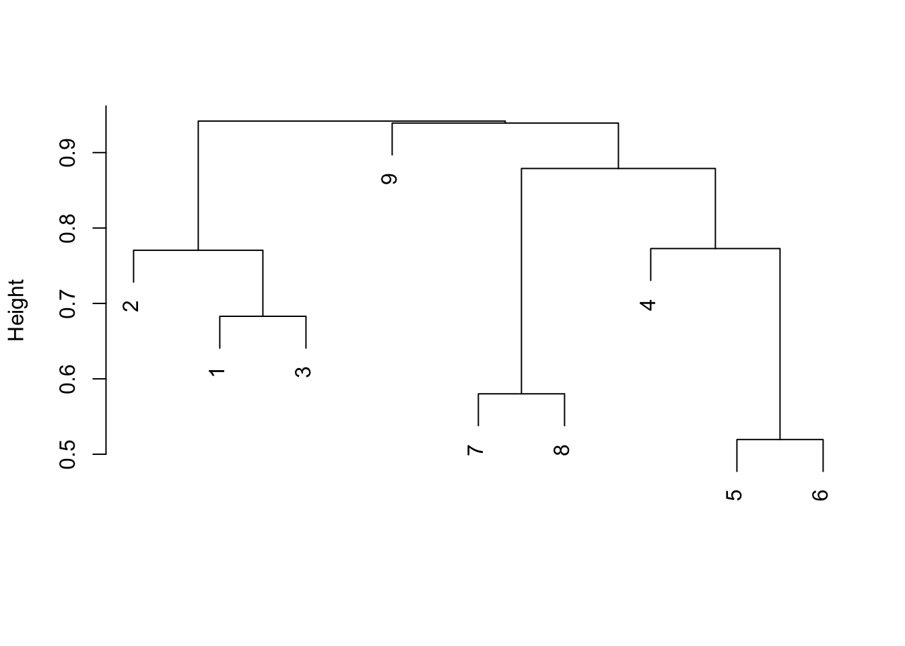
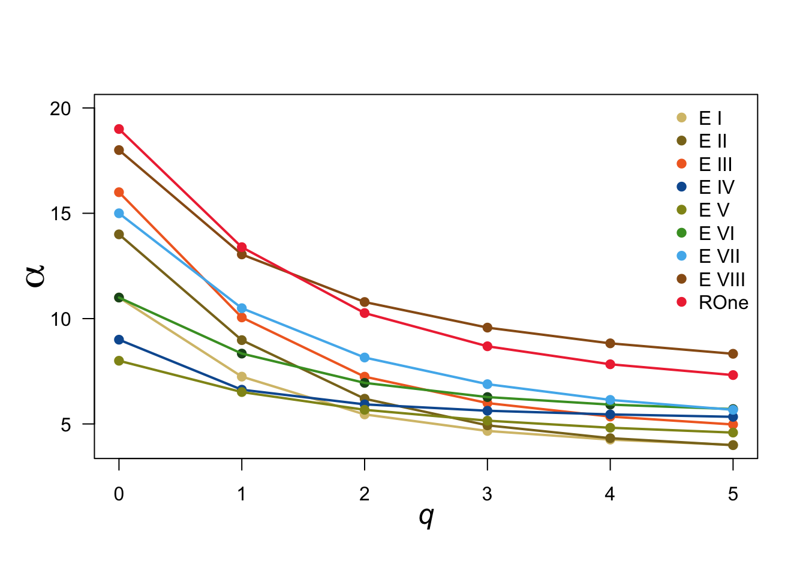

# Star Wars musical ecology
Chris Hamm  
`r format(Sys.time(), '%Y-%m-%d')`  

## Introduction

### Star Wars Oxygen
  I love [*Star Wars.*](http://www.starwars.com/) I love the story telling and fantasy, but I especially love the music. John Williams is amazing. There was a podcast out there called [*Star Wars Oxygen*](http://www.rebelforceradio.com/star-wars-oxygen/) that covered the music of *Star Wars* and it was one of my favorite podcasts of all time. [Jimmy Mac](http://www.rebelforceradio.com/jimmy-mac/) hosted while voice actor, musicician, and composer [David W. Collins](http://starwars.wikia.com/wiki/David_W._Collins) broke down the scores for the films we know and love in a way that gave me a new appreciation for the films. I say there *was a podcast* because the podcast went dark following the release of Rogue One. After 38 wonderful volumes the podcast just wasn't updated any more and we the fans have not heard anything about why they stopped producing the show. 

### Species diversity
  I also love statistics and ecology, which is the study of how organisms relate to each other and their environments. One exciting area of research deals with **diversity.** We can use statistics to figure out how many things live in a certain area and compare how different habitats are similar or different to one another. In order to conduct an analysis like this you need a "count matrix," which has **habitats** on rows and **species** in columns. The cells are filled in with counts of how many of each **species** is found in each habitat. An example of a count matrix could look like this:
  
  ||*Danaus plexippus*|*Vanessa cardui*|*Adelpha bredowii*|
  |:--:|:--:|:--:|:--:|
  |Donner Pass|5|6|0|
  |Sierraville|4|2|2|
  |Davis|0|0|3|
Table: Example of a count matrix where each row represents a habitat and each column represents a species. The cells are filled in with counts of the number of each species observed at each habitat.

In this example, we can see that Donner Pass and Sierraville are similar to each other for two species. Also Davis and Sierraville are somewhat similar to each other because they have one species in common. If we were going to group these sites based on similarity, Donner Pass and Sierraville would be more similar to each other than to Davis.

If we plot these relationships as a tree (after some statistical wankery) we see that Donner Pass and Sierraville appear close together with Davis far apart from them. 

Cluster plot of the toy example referred to above.

Please note here that I have created this page using `RMardown` in `RStudio`. All of the code and data used to create this post are freely available through this project's [`github` repository]().

### Star Wars musical ecology

During the *Star Wars Oxygen* podcast, David W. Collins began what he called his "theme tracker," which was essential a spreadsheet of the number of times a theme played per film. 

David W. Collins made a count matrix. 

We can apply statistics to *Star Wars*!!!! Oh happy day!!!

## The data

To reverse enginerer the theme tracker I listened back through all of the *Star Wars Oxygen* episode with pencil and paper ready. I made note of how often a theme was played during a particular film every time Mr. Collins mentioned it. In some instances, I had to get a bit of help and I read the breakdowns and threads from these sites:

* [jwfan.com](http://www.jwfan.com/)
* [*Star Wars* wikia](http://starwars.wikia.com/wiki/Binary_Sunset)
* [TheForce.net](http://boards.theforce.net/threads/force-theme-archive-just-how-many-tracks-is-the-force-theme-in-anyways.8458343/)

This was especially helpful when going the **AOTC**, which had a lot of music edits.

The data I ended up with, and which is used here had:

* **7** rows - one for each film ("ecosystem")
* **35** columns - one for each theme ("species")

These data could be incomplete and are in need of improvement. I am particularly concerned by the lack of "rare" themes in the data set. Rare things are important in ecology. There are two ways you could contribute:

* Edit a [Google Doc](https://docs.google.com/spreadsheets/d/1zN0OdNH8btShE3pk09FUaM7Z-UhRg9gZdgxe_IKWkfY/edit?usp=sharing)
* Submit a PR through [`github`](https://github.com/butterflyology/Star_Wars_musical_ecology) (for those with technical skills).
* Email me through my [website](https://butterflyology.github.io/)

## Analysis

### Clustering
Now we'll make a tree depicting the relationships between the seven films of the *Star Wars* saga just as we did in the above example. 

A prediction on the clustering analysis. The three original trilogy films will cluster together and the pre-quels will cluster together. I think that TFA will be more similar, musically, to the original trilogy than the pre-quels. 

Clustering of the Star Wars films based on the their musical theme counts.

### Jost's D

Here we count the number of different themes and consider how many different themes there are if we weight "rarity." 

Plot of the effective number of themes by Star Wars film

To read this plot we look at the y (vertical) axis to see the number of themes. Along the x (horizontal) axis we have the different weights we place on "rarity." A weight of 0 means that all themes are equal and it represents the actual number of themes present in each film. As we move right along the x axis we decrease the effect that a rarely occuring theme has on the y axis value. All the way to the right we hardly consider the effect that rare themes have on the effective number of themes. 

Note that Episode IV has the fewest number of themes. This is likely a result of incomplete data in the spreadsheet. E III has the most themes in our data set. One thing that appears evident from this analysis, is that all films have ~6 themes frequently used throughout. 

One last note of geekery. The colors from that plot were made with an `R` pacakge called [`spaceMovie`](https://github.com/butterflyology/spaceMovie) that uses colors from the *Star Wars* films.

### NMDS

Lastly, I want to employ a method callen **NMDS** (**N**on-**M**etric Multi**D**imensional **S**caling) which  plots the locations of each "habitat" in ordination space. This doesn't mean much except to say that similar things should be closer together than dissimilar things. 

NMDS Ordination plot of the 7 Star Wars films.

Here we see that the original trilogy films are closer to each other than they are to other films, and TFA is still closest to the original trilogy. The prequels are spread out a bit but one could easily draw a circle around those films without including any of the other films. *The Force Awakens* is out there by itself a bit but still closest to the original trilogy.

## Conclusions

I have three big take aways about the music of the *Star Wars* films from this exercise:

1. The original trilogy films are most similar to each other.
1. The prequel films are most similar to each other.
1. *The Force Awakens* is more similar to the original trilogy than to the prequels.

These results make a lot of sense to me. I interpret these results to mean that John Williams kept similar themes throughout each of the two trilogies, and that *The Force Awakens* is building off of the original trilogy, which is the most recent one relative to *TFA*. 
